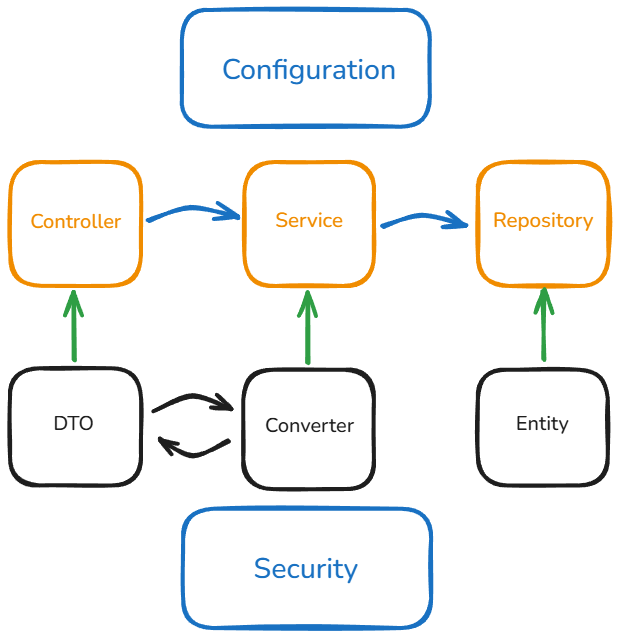
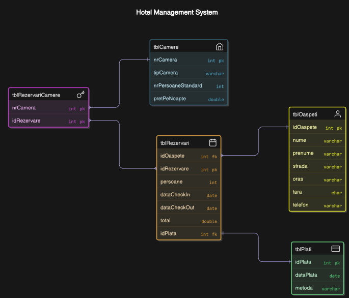

# 🏨 Hotel Booking Web App (Golden Peak Hotel)
A full-stack hotel booking system built with Spring Boot, MySQL, HTML/CSS/JS. It includes an admin panel for managing rooms, clients, and reservations, and a user interface for booking. The system also provides statistics like top rooms and total revenue.


# RO LANGUAGE 

## 📸 Demo

[*(Videoclip de prezentare a aplicatiei)*](https://www.youtube.com/watch?v=0uAikZXXtNE)


---

## ⚙️ Tehnologii folosite

- **Backend**: Spring Boot, Spring MVC, Spring Security, Spring Data JPA, Java Mail, Thymeleaf
- **Frontend**: Bootstrap, JavaScript
- **Bază de date**: MySQL
- **Altele**: BCrypt, Token URI Confirmation, Maven
- **Build & Deploy**: Maven + Spring Boot CLI

---

## 🧱 Arhitectură




---

## 🗄️ Diagrama Bazei de Date



---

## 🧩 Funcționalități principale

### 👤 Utilizator

- ✅ **Înregistrare** cont cu token de confirmare email (cu expirare)
- ✅ **Autentificare** + logout
- ✅ Criptare parolă cu **BCrypt**
- ✅ **Creare rezervare** (cu generare factură pe email)
  - **Codul** de **confirmare** este inclus în factură și poate fi folosit:
    - pentru a *căuta rezervarea*
    - sau pentru a o *furniza la recepția hotelului spre modificare sau anulare*
- ✅ **Vizualizare camere** disponibile filtrate după:
  - *Număr persoane*
  - Dată *check-in / check-out*
- ✅ **Editare + ștergere cont**

---

### 🔐 Administrator

- ✅ **GET + Filtrare** in funcție de Data Check-in/Check-out si nr. persoane
- ✅ **CRUD** complet **oaspeți**
- ✅ **CRUD rezervări**
- ✅ Pagină de **statistici**:
  - *Top 3 camere* care au adus *cei mai mulți bani*
  - Cei mai *fideli oaspeți* (după nr. de rezervări)
- ✅ Pagină cu **rezervări active** (în funcție de data curentă)

---

## 🧠 Logica disponibilității camerelor

- ✅ Query personalizat în backend pentru a verifica camerele disponibile în intervalul ales și pentru nr. de persoane
- ✅ Selectarea camerelor dintr-un formular interactiv (bara de selecție), printr-un GET pe un endpoint
- ✅ Rezervările sunt verificate în timp real pentru suprapuneri
- ✅ Corner case-uri in cazul in care user-ul nu iși activează contul este automat șters din DB după 10 minute

---

## 📁 Structura proiectului

```bash
## 🌲 Structura proiectului

```text
BookingSystem/
├── .idea/
├── .mvn/
├── src/
│   └── main/
│       ├── java/
│       │   └── com/example/AdminDashboard/
│       │       ├── Configuration/
│       │       ├── Controller/
│       │       ├── Converter/
│       │       ├── DTO/
│       │       ├── Entity/
│       │       ├── Event/
│       │       ├── Exception/
│       │       ├── Repository/
│       │       ├── Security/
│       │       ├── Service/
│       │       ├── Utils/
│       │       └── AdminDashboardApplication.java
│       └── resources/
│           ├── static/
│           └── templates/
```
# EN LANGUAGE 

---

## 📸 Demo

[*(Application demo video)*](https://www.youtube.com/watch?v=0uAikZXXtNE)


---

## ⚙️ Technologies Used

- **Backend**: Spring Boot, Spring MVC, Spring Security, Spring Data JPA, Java Mail, Thymeleaf  
- **Frontend**: Bootstrap, JavaScript  
- **Database**: MySQL  
- **Others**: BCrypt, Token URI Confirmation, Maven  
- **Build & Deploy**: Maven + Spring Boot CLI  

---

## 🧱 Architecture


---

## 🗄️ Database Diagram


---

## 🧩 Main Features

### 👤 User

- ✅ **Register** an account with **email confirmation token** (with expiration)  
- ✅ **Login** + logout  
- ✅ Password encryption using **BCrypt**  
- ✅ **Create reservation** (generates invoice sent via email)  
  - A **confirmation code** is included in the invoice, which can be used:
    - to *search for the reservation*
    - or to *provide it at the hotel reception for editing/cancellation*  
- ✅ **View available rooms** filtered by:
  - *Number of guests*
  - *Check-in / Check-out date*  
- ✅ **Edit and delete** account  

---

### 🔐 Administrator

- ✅ **GET + Filtering** based on Check-in/Check-out date and number of guests  
- ✅ Full **CRUD for guests**  
- ✅ Full **CRUD for reservations**  
- ✅ **Search guests** by **phone number**  
- ✅ **Statistics page**:
  - *Top 3 rooms* with the *highest revenue*
  - *Most loyal guests* (based on number of reservations)  
- ✅ Page showing **active reservations** (based on current date)  

---

## 🧠 Room Availability Logic

- ✅ Custom backend query to check available rooms based on selected date range and number of guests  
- ✅ Room selection via interactive form (selection bar), through a GET request  
- ✅ Real-time reservation overlap check  
- ✅ Corner cases handled:
  - Users who do not confirm registration within **10 minutes** are automatically deleted from the database  

---

## 📁 Project Structure

```text
BookingSystem/
├── .idea/
├── .mvn/
├── src/
│   └── main/
│       ├── java/
│       │   └── com/example/AdminDashboard/
│       │       ├── Configuration/
│       │       ├── Controller/
│       │       ├── Converter/
│       │       ├── DTO/
│       │       ├── Entity/
│       │       ├── Event/
│       │       ├── Exception/
│       │       ├── Repository/
│       │       ├── Security/
│       │       ├── Service/
│       │       ├── Utils/
│       │       └── AdminDashboardApplication.java
│       └── resources/
│           ├── static/
│           └── templates/

